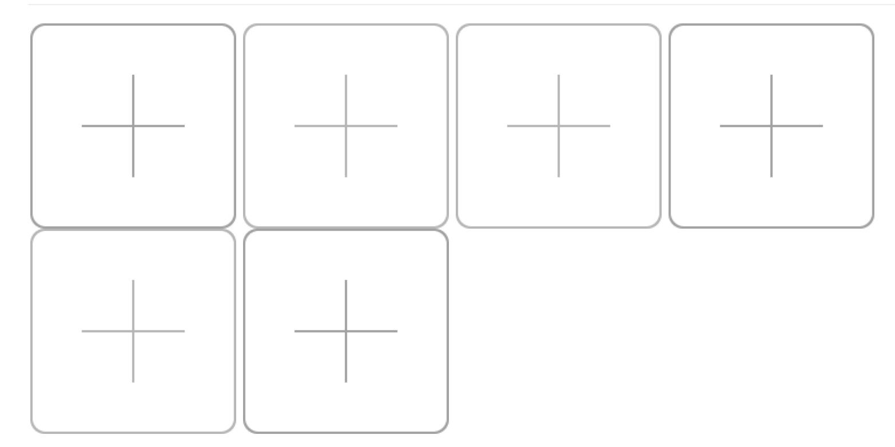
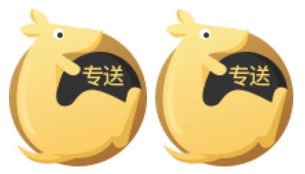
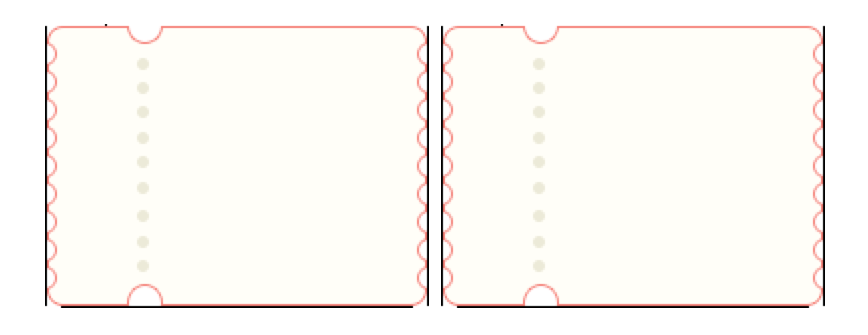
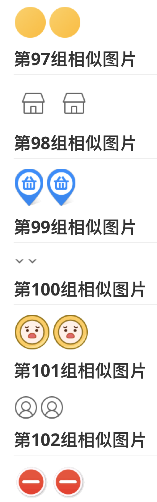
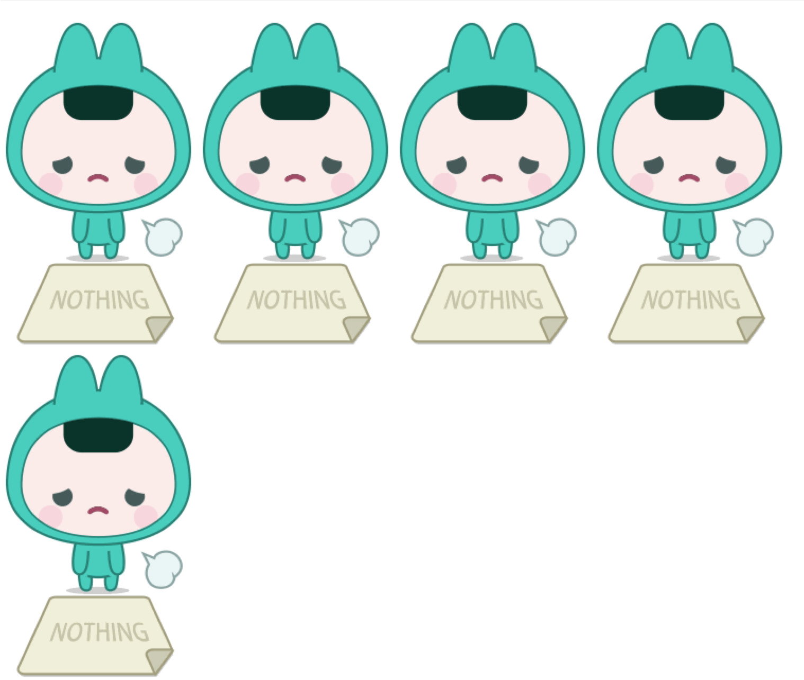
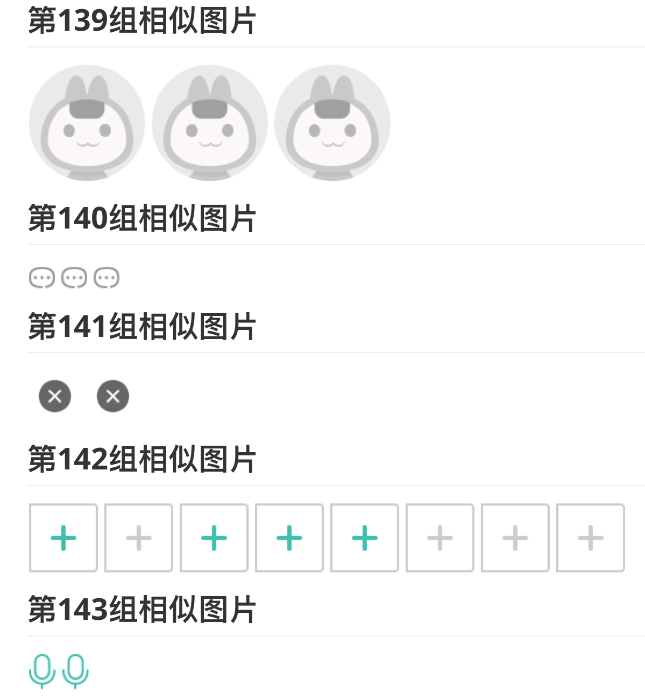
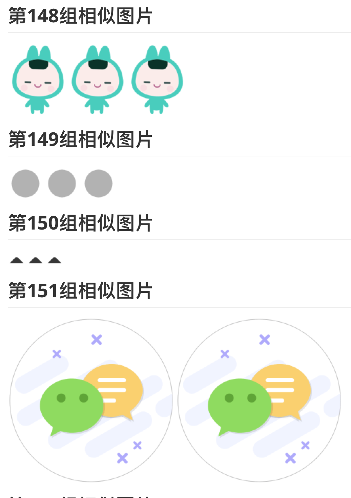
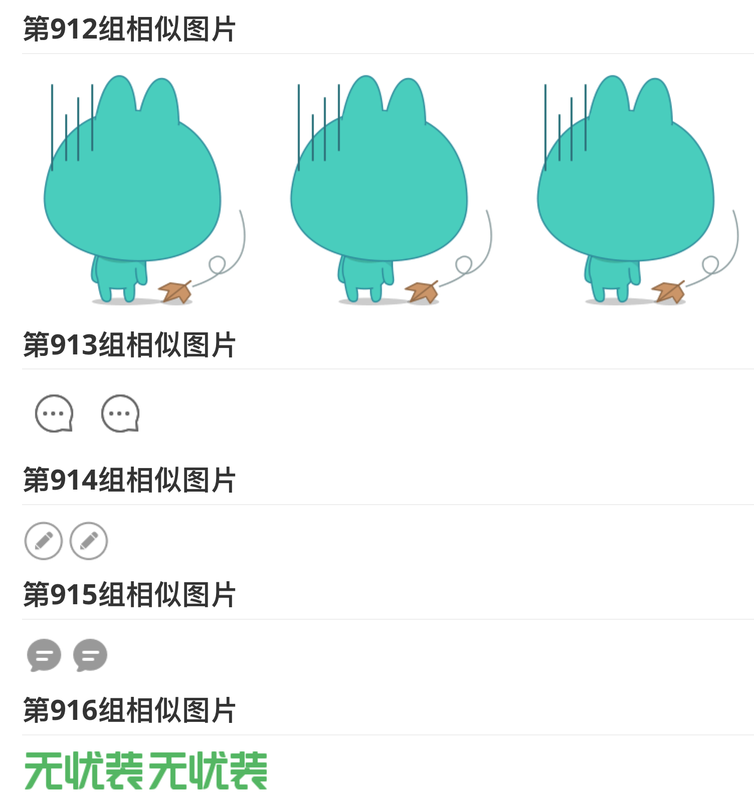
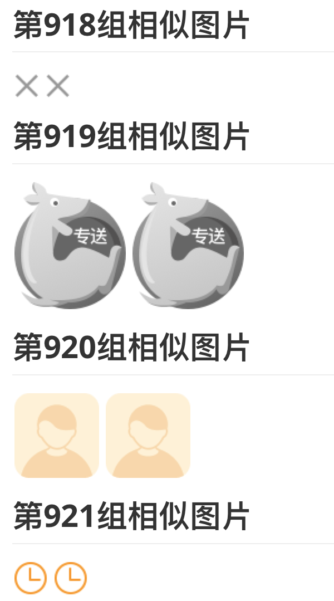
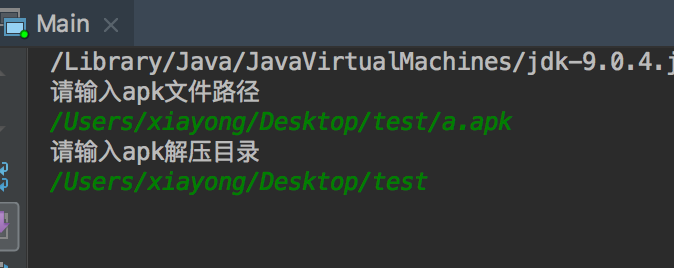

# Android相似图片查找

## 1、背景

在平时的项目中，常常存在冗余的切图资源，这些冗余资源既白白增加了apk的大小，同时也不符合软件开发规范。因此，十分有必要将冗余资源去除。然而，一个项目里面，切图资源少则上百，多则上千，而且分布在drawable和mipmap的多个不同分辨率文件夹下。更可怕的如果采用组件化开发，相同的图片资源存在不同的组件中，想要找出哪些图片是重复的，肯定是一件痛苦的事情。这个项目正是诞生在这样的背景下，我们的目标就是找出这些冗余的图片资源，解决掉这个痛点。

## 2、效果图

以下的效果图是我们从美团Android安装包里扫描出来的，一共有1000+的重复图片！下面只截取了其中的一部分，如果能把重复图片去掉，相信apk体积会减少不小！

## 3、使用方式

1. 下载源代码到本地

2. 在IntelliJ IDEA中打开项目

3. 找到Main.java 运行即可

4. 成功运行Main.java后，会在Terminal中让你输入apk的路径和apk反编译的输出路径，例如：

5. 点击回车过一会儿便会在项目根目录下生成similar.md文件，记录着该apk中的相似图片。

## 4、步骤&原理

1. 采用apktool解压apk，然后找到解压后的apk中res目录下所有的drawable和mipmap文件夹
2. 扫描这些文件夹，找到以.png和.jpg为后缀的图片
3. 采用pHash算法、颜色分布算法和宽高比较筛选出相似图片
4. 将相似图片分组输出markdown

## 5、TODO

1. 输出jar包，加shell脚本，直接运行shell脚本，而无需编译源码。
2. 图片相似度算法还有很多其他方式，比如基于神经网络的等，在精度上可以进一步提高
3. 筛选效率上可以进一步优化